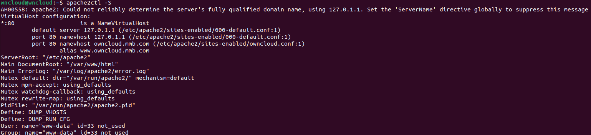

# Activitat 3: Owncloud

SMX-B MP08

####  Alumnes
* Marc Muria 

#### Professor
* Javier Sancho 

# Índex
##### 3.1
##### 3.2
##### 3.3
##### 3.4

## 3.1.- Llista els Virtual Hosts d'Apache per tal de veure si owncloud.XYZ.com està habilitat amb la comanda:

## 3.2.- A Owncloud podem veure que hi ha una serie de carpetes per defecte, mostra la ruta real a les tres carpetes dins de la teva MV.

## 3.3.- Al directori Learn more about owncloud hi ha informació en forma de fitxers pdf. Consulta'ls i respon aquestes preguntes:

###### ·Quin són els tres tipus de protecció de dades que ofereix Owncloud?

###### ·Fes una petita descripció de cada un d'ells.

###### ·Per quina raó ens recomana utilitzar Owncloud per als documents de Microsoft Office de la nostra empresa?

###### ·Això passa a tots els països?

###### ·Quina és la llicència d'OWncloud Enterprise?

###### ·I la d'Owncloud Standard?

###### ·Es poden veure videos en Streaming directament des de Owncloud?

###### ·Es poden connectar directoris de Google Drive a Owncloud?

###### ·I Dropbox?

###### ·Compta Owncloud amb antivirus? En cas afirmatiu com es diu?

## 3.4.- Mostra els següents canvis de paràmetres d'usuari:

###### ·Posa't una imatge d'usuari.

###### ·Afegeix el teu mail de l'Institut.

###### ·Canvia l'idioma a català.

###### ·Mostra la versió d'Owncloud instal·lada.

